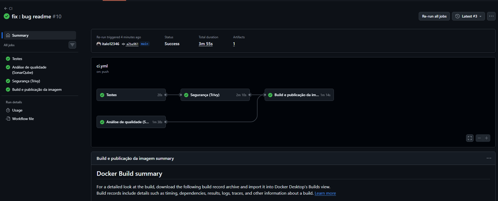
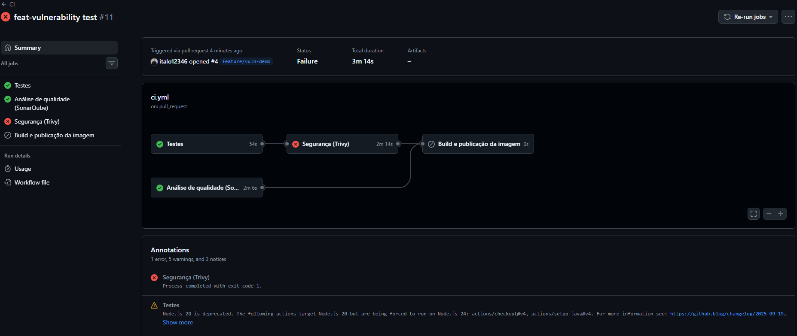
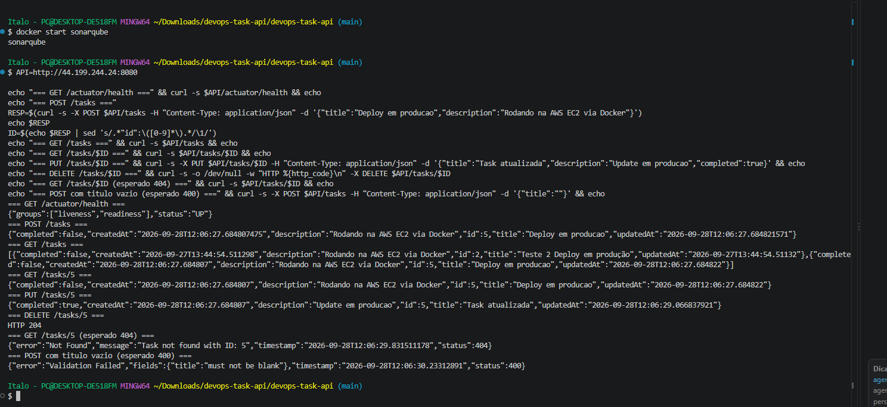
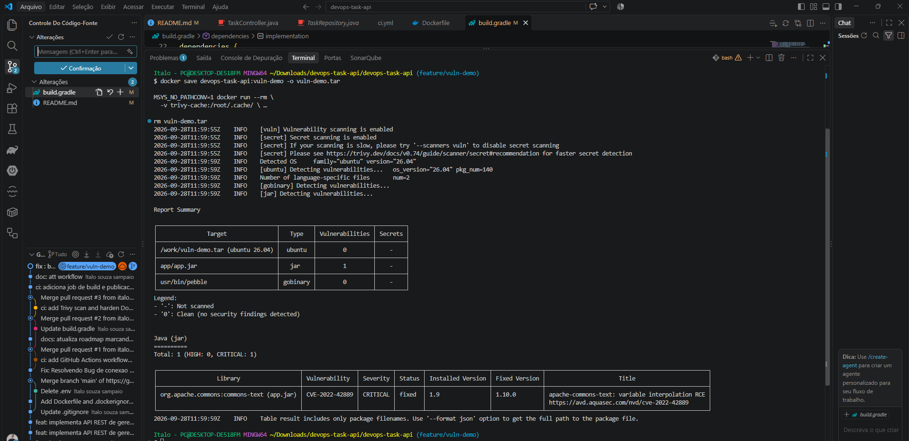
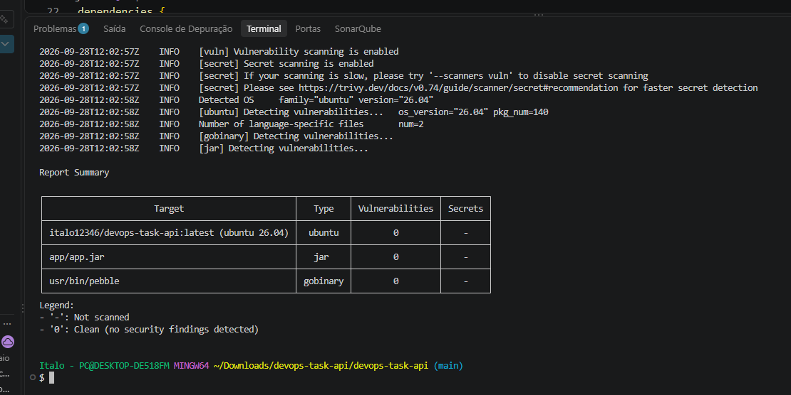
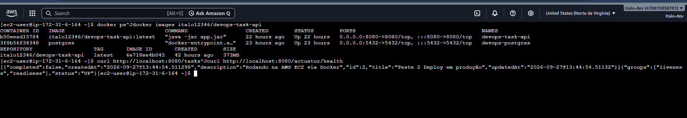

# DevOps Task API

API REST de gerenciamento de tarefas construída com **Spring Boot**, criada como projeto de estudo para praticar backend Java e, principalmente, um pipeline completo de **CI/CD e DevSecOps**.

O objetivo é entender o ciclo completo de entrega: desenvolvimento, testes, análise de qualidade, segurança, containerização e deploy em nuvem.

## Sobre o projeto

A API foi desenvolvida seguindo uma arquitetura em camadas:

```text
model → repository → service → controller
```

Também foram utilizados DTOs para separar o contrato da API das entidades do banco e tratamento centralizado de exceções.

## Stack

- **Java 21**
- **Spring Boot 4.1.1**
- **Spring Data JPA / Hibernate**
- **PostgreSQL**
- **Gradle**
- **Bean Validation**
- **JUnit 5 / Mockito**
- **Docker**
- **GitHub Actions**
- **SonarQube**
- **Trivy**
- **Docker Hub**
- **AWS EC2**

## Endpoints

| Método | Rota | Descrição |
|--------|------|-----------|
| GET | `/health` | Verifica se a aplicação está no ar |
| GET | `/tasks` | Lista todas as tasks |
| GET | `/tasks/{id}` | Busca uma task por ID |
| POST | `/tasks` | Cria uma nova task |
| PUT | `/tasks/{id}` | Atualiza uma task |
| DELETE | `/tasks/{id}` | Remove uma task |

## Arquitetura

```text
model/       → entidade JPA
repository/  → acesso ao banco
service/     → regras de negócio
controller/  → endpoints REST
dto/         → entrada e saída da API
exception/   → tratamento de erros
```

## CI/CD + DevSecOps

O projeto possui uma pipeline automatizada com:

```text
Push / Pull Request
        ↓
      Tests
        ↓
    SonarQube
        ↓
      Trivy
        ↓
   Docker Build
        ↓
    Docker Hub
        ↓
      AWS EC2
        ↓
   Health Check
```

### Pipeline

Execução com sucesso:

<p align="center">
  
</p>

A pipeline também foi configurada para bloquear a entrega quando uma vulnerabilidade é identificada:

<p align="center">
  
</p>

### SonarQube

Análise automatizada de qualidade do código:

<p align="center">
  
</p>

### Trivy

O Trivy realiza a análise de vulnerabilidades da imagem Docker.

Exemplo de vulnerabilidade encontrada:

<p align="center">
  
</p>

Após as correções, a imagem passou novamente pelo scan:

<p align="center">
  
</p>

### Deploy AWS

A aplicação é publicada em uma instância **AWS EC2**:

<p align="center">
  
</p>

## Como rodar localmente

### Pré-requisitos

- Java 21
- Docker

### PostgreSQL

```bash
docker run --name devops-postgres \
  -e POSTGRES_PASSWORD=sua_senha \
  -e POSTGRES_DB=devops_task \
  -p 5432:5432 \
  -d postgres
```

Copie o `.env.example`:

```bash
cp .env.example .env
```

Configure as credenciais do banco e execute:

```bash
./gradlew bootRun
```

Teste:

```bash
curl http://localhost:8080/health
```

## Testes

```bash
./gradlew test
```

## Roadmap

- [x] API REST com CRUD completo
- [x] Testes unitários e de integração
- [x] Dockerfile com build multi-stage
- [x] GitHub Actions
- [x] Análise de qualidade com SonarQube
- [x] Varredura de vulnerabilidades com Trivy
- [x] Build e publicação da imagem no Docker Hub
- [x] Deploy automatizado em AWS/EC2
- [x] Health check pós-deploy

## Licença

Projeto de estudo, livre para uso e referência.
